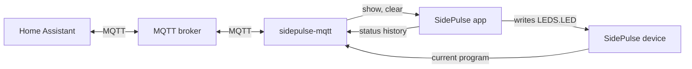

# sidepulse-mqtt

This bridge shows the agent status and the LEDs of a [SidePulse](https://sidepulse.io) device in Home Assistant. Home Assistant can also control the LEDs. The bridge runs on the Mac with the SidePulse menu-bar app, and it connects to your MQTT broker.



## What you get in Home Assistant


MQTT discovery adds one device, "SidePulse <Mac name>", with three entities:

| Entity | Type | What it shows |
| --- | --- | --- |
| Agent status | Sensor | Idle, Working, Ask, or Done, as in the SidePulse menu |
| Needs input | Binary sensor | On while an agent waits for you |
| LEDs | Light | The colour and the animation on the device. The `program` attribute holds the full LED program. |

Use the LEDs light to control the device:

| Action in Home Assistant | Result on the device |
| --- | --- |
| Pick a colour | That colour, until you change it |
| Pick an effect | That SidePulse animation, until you change it |
| Turn off | LEDs dark, until you change it |
| Turn on, with no colour or effect | Live agent status again |

While a colour or an effect holds, the LEDs show no agent status. The Needs input sensor still works, because it reads the agent status, not the LEDs. A newer push, a lid animation, a disconnect in the SidePulse menu, or an app restart also ends a hold.

For a short alert, publish to the `show` topic. An alert plays for 10 s by default. Then the device shows live status again.

## Requirements

- macOS, with the SidePulse menu-bar app from [inteliwear/sidepulse](https://github.com/inteliwear/sidepulse) and a SidePulse Pro or Dot.
- [uv](https://docs.astral.sh/uv/).
- An MQTT broker, for example the Mosquitto add-on.
- Home Assistant with the MQTT integration and the default discovery prefix, `homeassistant`.

The two sensors and the LED state work with the current SidePulse app. LED control and alerts need the `show` and `clear` socket commands from [inteliwear/sidepulse#56](https://github.com/inteliwear/sidepulse/pull/56). That PR is not merged yet.

## Install

```sh
git clone https://github.com/benkelly/sidepulse-mqtt.git
cd sidepulse-mqtt
MQTT_HOST=homeassistant.local MQTT_USERNAME=mqtt ./install.sh
```

If you set `MQTT_USERNAME`, the installer asks for the password once and keeps it in the Keychain. The LaunchAgent file contains no secret.

macOS can ask if `uv` can find devices on your local network. Click Allow. Without this permission, the bridge cannot reach the broker.

To update, run `git pull`. Then run `install.sh` again with the same settings.

| Variable | Default | Purpose |
| --- | --- | --- |
| `MQTT_HOST` | none, required | Address of the MQTT broker |
| `MQTT_PORT` | `1883` | Port of the MQTT broker |
| `MQTT_USERNAME` | none | Login for the broker. The password goes into the Keychain. |

## MQTT topics

`<node>` is `sidepulse_` and the short host name of the Mac, in lowercase. An example is `sidepulse_my_macbook`.

| Topic | Direction | Content |
| --- | --- | --- |
| `sidepulse/<node>/state` | Bridge to broker | Agent status as JSON |
| `sidepulse/<node>/availability` | Bridge to broker | `online` or `offline` |
| `sidepulse/<node>/light` | Bridge to broker | LED state as Home Assistant JSON light state |
| `sidepulse/<node>/light/set` | Broker to bridge | Light commands from Home Assistant |
| `sidepulse/<node>/show` | Broker to bridge | Alerts |

An alert is JSON or plain text:

```json
{"program": "off\n#0080FF 0.5s pulse\nrepeat\n", "seconds": 8}
```

A plain-text alert is the LED program itself, and it plays for 10 s. An alert lasts at most 60 s. A program has at most 512 bytes and 20 lines. The LED language is in [LEDS_FORMAT.md](https://github.com/inteliwear/sidepulse/blob/main/LEDS_FORMAT.md).

The bridge ignores retained messages on `show` and `light/set`. An old command therefore does not play again after a restart.

## Examples

Show a doorbell alert on the device:

```yaml
- alias: Doorbell on SidePulse
  triggers:
    - trigger: state
      entity_id: binary_sensor.front_door_doorbell
      to: "on"
  actions:
    - action: mqtt.publish
      data:
        topic: sidepulse/sidepulse_my_macbook/show
        payload: '{"program": "off\n#0080FF 0.5s pulse\nrepeat\n", "seconds": 8}'
```

Send a notification when an agent waits for two minutes:

```yaml
- alias: Agent waits for me
  triggers:
    - trigger: state
      entity_id: binary_sensor.sidepulse_my_macbook_needs_input
      to: "on"
      for: "00:02:00"
  actions:
    - action: notify.notify
      data:
        message: An agent on the Mac waits for your input.
```

Replace the entity IDs and the topic with your own. Find them in Settings → Devices & services → MQTT.

## Troubleshooting

The log is `~/Library/Logs/sidepulse-mqtt.log`.

| Log line | Cause | Fix |
| --- | --- | --- |
| `cannot reach the broker, retrying` | macOS blocks local network access, or the broker is down. | Turn on `uv` in System Settings → Privacy & Security → Local Network. Then restart the bridge. |
| `connect failed: …` | The broker rejects the login. | Store the correct password. Then restart the bridge. |
| `show: error: no reply, so the app has no show command yet` | The SidePulse app has no `show` command. | Install a SidePulse version with inteliwear/sidepulse#56. |
| `cannot read the device: …` | macOS blocks access to the SidePulse volume. | Allow `uv` to access removable volumes in System Settings → Privacy & Security. |

The Local Network permission belongs to the exact `uv` binary. After uv updates itself, macOS can block the bridge again.

Restart the bridge:

```sh
launchctl kickstart -k gui/$(id -u)/local.sidepulse-mqtt
```

Store a new password. The command asks for it:

```sh
security add-generic-password -U -s sidepulse-mqtt -a "$USER" -w
```

## Test

`check_bridge.py` runs the bridge against a real broker. It uses a temporary status history, socket, device volume, and animations. It does not touch your SidePulse app or device.

```sh
docker run -d --rm --name sidepulse-mqtt-check -p 127.0.0.1:18830:1883 eclipse-mosquitto:2 mosquitto -c /mosquitto-no-auth.conf
./check_bridge.py
docker stop sidepulse-mqtt-check
```

Expected output: ten lines that start with `ok`, and then `ok: all checks passed`.

## Remove

```sh
launchctl bootout gui/$(id -u)/local.sidepulse-mqtt
rm ~/Library/LaunchAgents/local.sidepulse-mqtt.plist
rm -r ~/.local/share/sidepulse-mqtt
security delete-generic-password -s sidepulse-mqtt -a "$USER"
```

To remove the device from Home Assistant, delete it in Settings → Devices & services → MQTT.

## Limits

- The bridge reads the status history of the Python SidePulse app. The Rust migration in [inteliwear/sidepulse#52](https://github.com/inteliwear/sidepulse/pull/52) changes this interface. See [inteliwear/sidepulse#55](https://github.com/inteliwear/sidepulse/issues/55).
- The light shows the first colour of the program. An animation with more colours shows only one colour on the tile.
- Effect names come from the file names of the app animations, for example "Kitt" for KITT Scanner.
- The brightness slider in Home Assistant sends a darker colour. The device brightness in SidePulse still limits the output.

## License

MIT. SidePulse and its LED language come from [inteliwear/sidepulse](https://github.com/inteliwear/sidepulse) (MIT). This bridge is an independent client of its file and socket interfaces.
